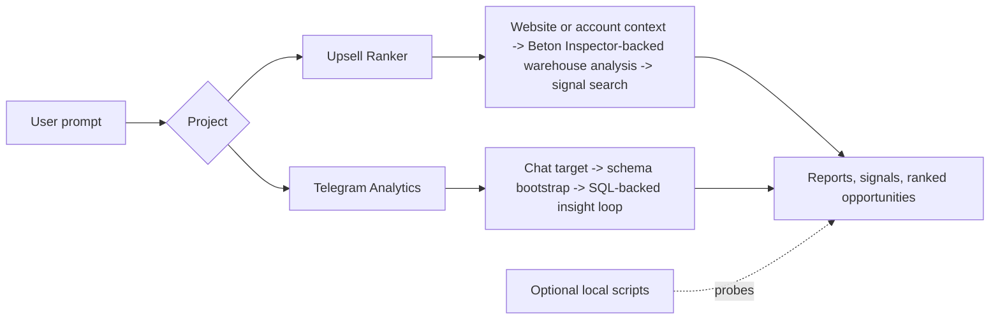

# Agent Systems Workspace

ML/backend workspace for Beton's agentic analytics systems. This repo contains the backend agent logic that powers Beton product experiences around signal discovery, warehouse reasoning, and evidence-backed analysis workflows.



The repo keeps multiple agent lineages side by side so architectural changes stay explicit. The latest versions of both projects are optimized for iterative analysis and are currently most reliable when deployed with Beton Inspector in front of protected systems. A standalone mode that connects directly to systems such as [PostHog](https://www.getbeton.ai/integrations/posthog/), [Attio](https://www.getbeton.ai/integrations/attio/), and [similar integrations](https://www.getbeton.ai/integrations/) is planned but not implemented yet.

## Product Context

This repository is the `inspector-ml-backend` for Beton. It is not the full product surface by itself.

- Product website: [www.getbeton.ai](https://www.getbeton.ai/)
- Pricing and hosted trial: [www.getbeton.ai/pricing](https://www.getbeton.ai/pricing/)
- Integrations catalog: [www.getbeton.ai/integrations](https://www.getbeton.ai/integrations/)
- Demo stand / product-facing repo: `https://github.com/getbeton/inspector/tree/staging`

Use those references to understand the product this backend connects to:

- [getbeton.ai](https://www.getbeton.ai/) is the public product entry point for Beton.
- The `getbeton/inspector` staging branch is the demo stand and product-facing layer that sits in front of this ML/backend repo.
- This repository provides the agent workflows and warehouse-analysis backend that the Beton product layer can call into.

## Projects

- `projects/upsell_ranker` contains the upsell opportunity lineage.
- `projects/telegram_analytics` contains the Telegram chat analytics lineage.
- `scripts/` contains optional local utilities for one-off probing rather than the main agent runtime.

## Repository Layout

```text
projects/
  upsell_ranker/
    versions/
      v0.0.0/
      v0.0.1/
      v0.0.2/
  telegram_analytics/
    versions/
      v0.0.1/
scripts/
```

## Setup

```bash
python -m venv .venv
source .venv/bin/activate
pip install -r requirements.txt
cp .env.example .env
```

Fill `.env` with only the variables needed for the version you want to run. `.env.example` contains placeholders only and should not be treated as working credentials.

## How To Test

Use `adk web` as the primary local workflow. It starts the ADK server with a web UI, which is the intended path for interactive testing, prompt iteration, and debugging.

Upsell ranker:

```bash
adk web /home/user/upsale-agent/projects/upsell_ranker/versions/v0.0.2
```

Telegram analytics:

```bash
adk web /home/user/upsale-agent/projects/telegram_analytics/versions/v0.0.1
```

Keep `adk api_server` for production-style or external API integration scenarios:

```bash
adk api_server --host 0.0.0.0 --port 8000 /home/user/upsale-agent/projects/upsell_ranker/versions/v0.0.2
adk api_server --host 0.0.0.0 --port 8000 /home/user/upsale-agent/projects/telegram_analytics/versions/v0.0.1
```

Legacy baseline smoke check:

```bash
python -c "import sys; sys.path.append('/home/user/upsale-agent/projects/upsell_ranker/versions/v0.0.0'); from scoring import rank_accounts; print(rank_accounts(top_n=5))"
```

## Environment

Core variables used in the repo:

```bash
GOOGLE_API_KEY=
AGENTOPS_API_KEY=

ATTIO_TOKEN=
ATTIO_LIMIT=200
ATTIO_MAX_PAGES=10
ATTIO_CACHE_TTL_SEC=21600

INSPECTOR_URL=
AGENT_SECRET=
VERCEL_PROTECTION=

UPSELL_AGENT_MODEL=gemini-3-flash-preview
DWH_ANALYST_MODEL=gemini-3-flash-preview
SIGNAL_AGENT_MODEL=gemini-3-flash-preview
SIGNAL_REVIEWER_MODEL=gemini-3-flash-preview

SIGNAL_AGENT_MAX_QUERIES=6
SIGNAL_AGENT_MAX_ROWS=200
SIGNAL_AGENT_MAX_ITERATIONS=8
SIGNAL_AGENT_TARGET_PROMOTED=3
SIGNAL_AGENT_MAX_FAILURES=5
SIGNAL_AGENT_MIN_ITERATIONS_BEFORE_EXIT=3

TELEGRAM_ANALYTICS_MODEL=gemini-3-flash-preview
TELEGRAM_ANALYTICS_REVIEWER_MODEL=gemini-3-flash-preview
TELEGRAM_DB_HOST=127.0.0.1
TELEGRAM_DB_PORT=5432
TELEGRAM_DB_NAME=
TELEGRAM_DB_USER=
TELEGRAM_DB_PASSWORD=
```

## Open-Source Notes

- This repository is licensed under AGPLv3. See `LICENSE`.
- Beton Inspector is currently the security-focused product path for protected warehouse access in the newest agent versions.
- Direct standalone integration flags for systems such as [PostHog](https://www.getbeton.ai/integrations/posthog/) and [Attio](https://www.getbeton.ai/integrations/attio/) are planned.
- Recent experiments show that explicitly defining the target metric for an agent is the strongest lever on analysis quality.

## Notes

- Generated artifacts, caches, logs, and local report outputs are intentionally ignored.
- Version-specific details live in each project and version README.
- Public docs use "warehouse" in place of internal shorthand such as "DWH" on first mention.


---

## About

This backend is part of [Beton](https://www.getbeton.ai/), open-source revenue intelligence. The agent it powers is described at [getbeton.ai](https://www.getbeton.ai/), and its native data integrations are documented at [getbeton.ai/integrations](https://www.getbeton.ai/integrations/).

Related Beton open-source tools:

- [Inspector](https://github.com/getbeton/inspector) — the front-end agent + workspace this backend serves
- [DryFit](https://www.getbeton.ai/oss-tools/dryfit/) — synthetic analytics datasets for agent benchmarking
- [openclaw-gtm-skills](https://www.getbeton.ai/oss-tools/openclaw-gtm-skills/) — company research pipeline for OpenClaw

Browse [all open-source tools by Beton →](https://www.getbeton.ai/oss-tools/)
