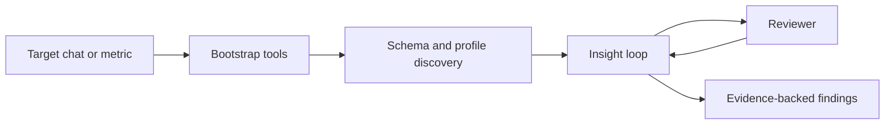

# Telegram Analytics

Agent experiments for extracting behavioral insights from Telegram chat data through read-only SQL investigation and reviewer-backed promotion.



The current tracked version is built for investigation rather than ETL. Recent experiments show that clearly explaining the target metric to the agent is the most important factor in getting useful analysis. The system currently focuses on secure, bounded exploration; a richer standalone mode and stronger statistical tooling are planned next.

## Versions

- `v0.0.1` is the current tracked implementation.

## Current Default

Preferred local test and debug path:

```bash
adk web /home/user/upsale-agent/projects/telegram_analytics/versions/v0.0.1
```

Production-style API serving:

```bash
adk api_server --host 0.0.0.0 --port 8000 /home/user/upsale-agent/projects/telegram_analytics/versions/v0.0.1
```

## Architecture

- Bootstrap tools discover the available chat schema.
- The main loop proposes candidate insights and validates them with read-only SQL.
- Reviewer logic keeps promoted insights narrow and evidence-backed.
- The quality of the result depends heavily on whether the agent is given the right target metric and enough historical evidence.

## Common Failure Modes

- The agent may infer the wrong target metric and optimize analysis around the wrong question.
- The system can produce naive results when the chat does not have enough history for serious statistical analysis.
- Chat schemas can be incomplete, poorly named, or unevenly populated.
- Database credentials may be incorrect, contain typos, or reference unavailable symbols.

## Roadmap

- Add a memory bank with reusable material on signal search, SQL query patterns, and data-analysis heuristics.
- Add more mathematical tools for agent use, including EDA, classical statistical methods, and classic ML algorithms for anomaly or signal search.
- Extend the signal toolbox with stronger temporal methods such as survival analysis, HMMs, and Hawkes processes.
- Make target-metric explanation a required part of prompts and operator guidance.
