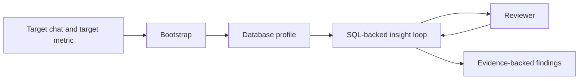

# Telegram Analytics v0.0.1

First tracked version of the Telegram chat analytics system. The workflow is designed for investigative analysis over a read-only PostgreSQL dataset, with bootstrap steps to map the schema before the agent starts promoting findings.



Recent experiments show that the strongest determinant of result quality is whether the operator explains the target metric clearly enough at the start. When that framing is vague, the system can still produce polished output while solving the wrong analytical problem.

## Capabilities

- Discovers likely message, user, reaction, and membership tables.
- Builds a database profile for a target chat.
- Runs a constrained insight loop to promote evidence-backed behavioral findings.

## Architecture Notes

- `chat_analytic/agent.py` defines the staged bootstrap, exploration, review, and finalization flow.
- `chat_analytic/tools.py` owns DB access, SQL policy checks, caching, and artifact persistence.
- The system is intentionally read-only and optimized for investigation, not ETL.

## Run

Preferred local test and debug path:

```bash
adk web /home/user/upsale-agent/projects/telegram_analytics/versions/v0.0.1
```

Production-style API serving:

```bash
adk api_server --host 0.0.0.0 --port 8000 /home/user/upsale-agent/projects/telegram_analytics/versions/v0.0.1
```

## Required Environment

```bash
TELEGRAM_DB_HOST=127.0.0.1
TELEGRAM_DB_PORT=5432
TELEGRAM_DB_NAME=
TELEGRAM_DB_USER=
TELEGRAM_DB_PASSWORD=
```

## Common Problems

- The agent may infer the wrong target metric if the prompt does not define it sharply.
- The system can produce naive conclusions when there is not enough data for meaningful statistical analysis.
- Database credentials may be incorrect, contain typos, or reference unavailable symbols.

## Roadmap

- Add a memory bank with reusable material on signal search, SQL query patterns, and data-analysis heuristics.
- Add more mathematical tools for agent use, including EDA, statistical methods, and classic ML algorithms for anomaly or signal search.
- Extend the signal agent with stronger temporal methods such as survival analysis, HMMs, and Hawkes processes.

## Limits

- Assumes PostgreSQL access.
- Threshold inference works best on active chats with enough history.
