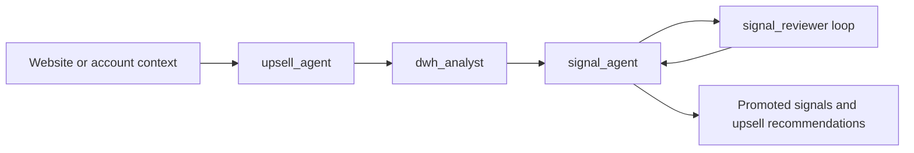

# Upsell Ranker

Agent experiments for finding, validating, and explaining expansion opportunities from company context plus warehouse evidence.



The lineage moves from a heuristic single-agent ranking baseline to a more modular system with focused roles. The current default version leans heavily on Beton Inspector for secure warehouse access and controlled query execution. A standalone direct-integration mode is planned so the same workflow can later connect to systems like Attio or PostHog without the Inspector layer.

## Versions

- `v0.0.0` is the baseline single-agent prototype over Attio exports.
- `v0.0.1` expands the workflow to a broader upsell dataset with external connectors.
- `v0.0.2` splits the system into focused agents for company understanding, warehouse exploration, and signal discovery.

## Current Default

`versions/v0.0.2`

Preferred local test and debug path:

```bash
adk web /home/user/upsale-agent/projects/upsell_ranker/versions/v0.0.2
```

Production-style API serving:

```bash
adk api_server --host 0.0.0.0 --port 8000 /home/user/upsale-agent/projects/upsell_ranker/versions/v0.0.2
```

## Architecture

- `upsell_agent` turns a website or account context into an initial business hypothesis.
- `dwh_analyst` maps available warehouse tables, joins, and candidate metric surfaces.
- `signal_agent` runs a guarded loop that proposes and validates reusable signals.
- Reviewer and SQL policy checks keep promoted signals evidence-backed and bounded.
- `shared/` contains cache and Inspector client helpers reused inside `v0.0.2`.

## Common Failure Modes

- `signal_agent` can exit the signal-search loop too early before enough candidates have been stress-tested.
- Control can shift to the wrong agent at the wrong time and break the intended orchestration.
- Weak warehouse metadata still leaves joins ambiguous and slows down the analysis loop.
- Noisy schemas can consume the query budget on validation work rather than useful promotion decisions.

## Roadmap

- Add a memory bank with reusable material on signal search, SQL query patterns, and data-analysis heuristics.
- Add more mathematical tools for agent use, including EDA helpers, stronger statistical methods, and classic ML methods for anomaly or signal search.
- Make target-metric specification a first-class part of prompts and system instructions because it currently drives the biggest quality gains.
