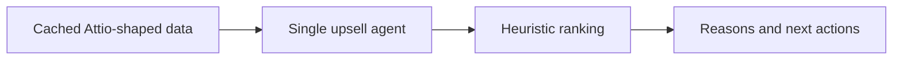

# Upsell Ranker v0.0.0

First tracked baseline for the upsell work. This version keeps the original ranking idea visible before later multi-agent splits and warehouse exploration were introduced.



## What Changed

- Single ADK agent over cached Attio data.
- Simple ranking flow with reasons and next actions.
- No multi-agent coordination and no warehouse exploration.

## Run

Preferred local test and debug path:

```bash
adk web /home/user/upsale-agent/projects/upsell_ranker/versions/v0.0.0
```

Production-style API serving:

```bash
adk api_server --host 0.0.0.0 --port 8000 /home/user/upsale-agent/projects/upsell_ranker/versions/v0.0.0
```

## Limits

- Depends on Attio-shaped data.
- Scoring is intentionally heuristic.
- Good for sanity checks, not deep investigation.
