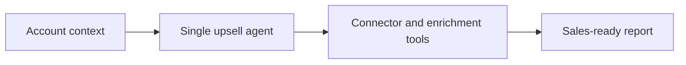

# Upsell Ranker v0.0.1

Second iteration of the upsell system. This version broadens the data-collection story and acts as the bridge between the baseline single-agent ranker and the modular multi-agent design in `v0.0.2`.



## Increment From v0.0.0

- Broader dataset assembly instead of ranking only raw Attio exports.
- Added connectors and enrichment-oriented tooling.
- Produces a more sales-ready report with coverage notes and next steps.

## Architecture Notes

- Still centered on one top-level upsell agent.
- External systems are pulled in through tool modules rather than separate specialist agents.
- This is the bridge between the simple baseline and the modular `v0.0.2` layout.

## Run

Preferred local test and debug path:

```bash
adk web /home/user/upsale-agent/projects/upsell_ranker/versions/v0.0.1
```

Production-style API serving:

```bash
adk api_server --host 0.0.0.0 --port 8000 /home/user/upsale-agent/projects/upsell_ranker/versions/v0.0.1
```

## Limits

- Integration availability changes output quality a lot.
- Prompt and output format are still tightly coupled inside one agent.
