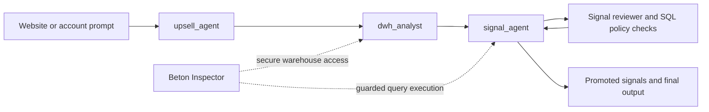

# Upsell Ranker v0.0.2

Current modular iteration of the upsell system. This version separates company understanding, warehouse exploration, and signal discovery into distinct roles so the agent loop can validate hypotheses instead of forcing one prompt to do everything at once.



The version is currently optimized around Beton Inspector integration for security, warehouse access control, and proxy-based query execution. A future standalone flag is planned so this same architecture can be deployed directly against integrations such as PostHog, Attio, and similar systems when a controlled Inspector layer is not required.

## Increment From v0.0.1

- Split the flow into specialist agents instead of one broad upsell agent.
- Added warehouse exploration through Inspector-backed tooling.
- Added a guarded signal-discovery loop with SQL policy checks and query budgeting.

## Architecture

- `upsell_agent` reads website context and emits a compact business hypothesis.
- `dwh_analyst` inspects warehouse tables, columns, join hints, and likely metric surfaces.
- `signal_agent` explores candidate signals with a reviewer loop and read-only SQL enforcement.
- Reviewer and policy checks keep the loop bounded and prevent weak signals from being promoted too early.
- `shared/` contains cache helpers and the Inspector client used across the version.

## Runtime Requirements

Required for the main secure warehouse flow:

```bash
INSPECTOR_URL=
AGENT_SECRET=
VERCEL_PROTECTION=
```

Optional tuning:

```bash
UPSELL_AGENT_MODEL=gemini-3-flash-preview
DWH_ANALYST_MODEL=gemini-3-flash-preview
SIGNAL_AGENT_MODEL=gemini-3-flash-preview
SIGNAL_REVIEWER_MODEL=gemini-3-flash-preview

SIGNAL_AGENT_MAX_QUERIES=6
SIGNAL_AGENT_MAX_ROWS=200
SIGNAL_AGENT_MAX_ITERATIONS=8
SIGNAL_AGENT_TARGET_PROMOTED=3
SIGNAL_AGENT_MAX_FAILURES=5
SIGNAL_AGENT_MIN_ITERATIONS_BEFORE_EXIT=3
```

## Run

Preferred local test and debug path:

```bash
adk web /home/user/upsale-agent/projects/upsell_ranker/versions/v0.0.2
```

Production-style API serving:

```bash
adk api_server --host 0.0.0.0 --port 8000 /home/user/upsale-agent/projects/upsell_ranker/versions/v0.0.2
```

Example prompt shape:

```text
Analyze website: 'https://example.com'. Use the Inspector callback URL to query the warehouse via proxy routes. Your session ID for Inspector callbacks is: sess_456. Your workspace ID is: ws_123. Return JSON only.
```

## Common Problems

- The signal-search loop can terminate too early before enough promising candidates have been explored.
- Control can shift to the wrong agent at the wrong time and break the intended orchestration.
- Sparse metadata samples keep join candidates tentative.
- Strict SQL policy intentionally rejects some queries to keep the loop bounded and read-only.

## Roadmap

- Add a memory bank with reusable material on signal search, SQL query patterns, and data-analysis heuristics.
- Add more mathematical tools for agent use, including EDA helpers, stronger statistical methods, and classic ML methods for anomaly or signal search.
- Make target-metric specification explicit earlier in the workflow to improve signal quality and reviewer decisions.
