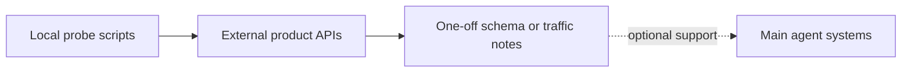

# Scripts

Small local utilities that are useful during investigation but are not part of the public agent runtime.

These scripts are auxiliary probes for narrow questions. They are not the primary way to evaluate the agent systems; use `adk web` against the versioned agents for the main local test and debug workflow.

## Included

- `posthog/posthog_probe.py` for lightweight PostHog schema and traffic inspection.
- `posthog/posthog_user_report.py` for one-off user-centric PostHog reports.

These scripts are optional and may need their own local environment variables.
